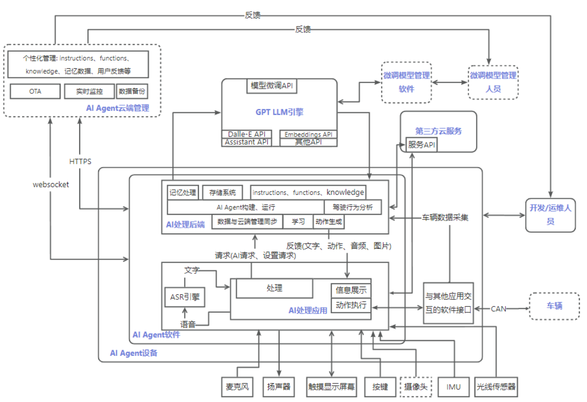
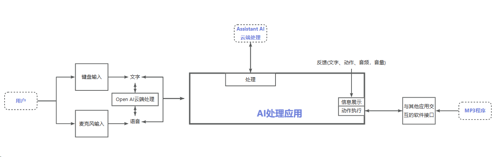

# In-car AI Bot
_Read this in [English](README_en.md)._

我们预计开发一款侧重于情感交互的车载AI Agent机器人，同时作为便携设备，可以带出车外使用，其核心功能有：
- 能够通过自然语言交互，理解人类意图，实现包括车辆控制、工具类应用和娱乐类应用等功能的调用。
- 能够对环境进行感知，例如车辆状态，车内环境，用户行为等，并给予实时反馈。
- 能够通过持续的训练和学习，记住驾驶员的喜好和习惯，从而提供个性化的服务和建议。
- 另外，自然流畅的交互体验，具有辨识度的语音形象，也是该产品的开发重点之一。


目前设想的最终架构图如下

基于此架构我们着手开发了这个基于OpenAI中Assistants API的智能助手程序，可以通过语音或文本与用户进行对话，并执行一些功能，如切换输出模式、设置音量、播放音乐等。程序中包含了录音功能，可以录制用户的语音输入并转录成文本，然后进行智能助手的回答和功能执行。同时也支持用户直接输入文本进行对话和操作。整个程序结合了多个模块和功能，使得智能助手能够实现更多的交互和服务。 
## 当前已实现的架构图


## 当前功能概述

- 该助手会基于自己是一个汽车车载智能语音助手进行问答
- 通过录音或文本输入与用户进行对话，并获取助手的回答。
- 支持切换输出模式、设置音量、播放音乐等功能。
- 使用OpenAI进行自然语言处理和生成回答。
- 使用pydub进行文本转语音和播放音频。

## 编译和安装
### API Key
首先修改 API KEY

- OPENAI_API_KEY 到 [API keys - OpenAI API](https://platform.openai.com/api-keys) 获取
- 进入run.py以及assistant.py文件中找到api_key=""填写您自己的API KEY
### Server
创建 Python 虚拟环境
```bash
conda create -n cat python=3.11
```
 进入 Python 虚拟环境
```bash
conda activate cat
```
安装项目依赖
```bash
cd server
pip install -r requirements.txt
```
启动server程序
```bash
python run.py
```
## 使用说明
- 可通过config.json进行模式的选择，如"input_mode"中：录音模式"record",输入模式"write"；"output_mode"中"audio"为读取音频模式，"text"为文字输出模式
- 在录音模式"record"下，按下回车键开始录音，再次按下回车键结束录音
- 在输入模式"write"下，可以直接打字模拟录音输入，按下回车即可对话
- 也可以在文字输入或者语音输入中提到"切换输出模式"，代码会调用函数进行模式的切换，当前是文字便切换为语音

## 使用建议

- 在运行代码前，请确保已安装所需的依赖库，如pyaudio、openai、opencc等。
- 根据实际需求修改配置文件和参数，如API密钥、音色选择等。
- 可根据需求扩展功能或定制特定功能，以满足个性化需求。

## 其他建议

- 需要在本地使用代理时，将run.py中的os.environ["http_proxy"] = "http://localhost:15732"
os.environ["https_proxy"] = "http://localhost:15732"中的"15732"改为自己的代理端口号。可通过搜索--代理服务器设置--手动代理--端口 查询代理端口
- 本软件使用播放声音时用到了ffmpeg库，确保本地安装了ffmpeg软件。可去官网下载"https://ffmpeg.org/"
## 版本说明
######V1.0.1  2024.3.1 #######
1. 实现车载AI语音实时交流功能
2. 增加互动功能--播放音乐

这段代码展示了一个基本的智能助手程序的实现，可以作为学习和参考，也可以根据实际需求进行定制和扩展。 