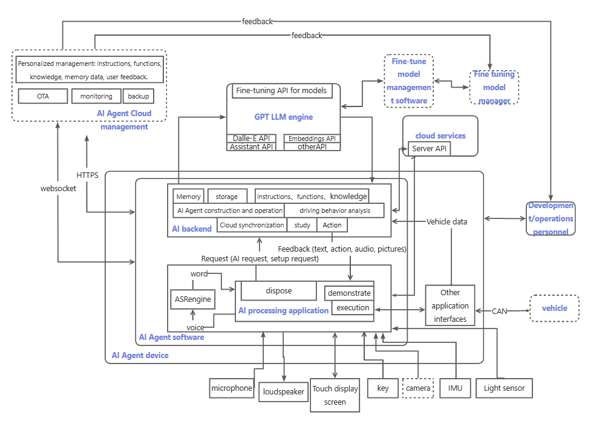
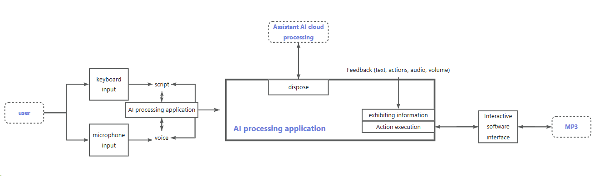

# In-car AI Bot
_Read this in [Chinese](README.md)._

We plan to develop an in-car AI Agent robot that focuses on emotional interaction and can also be used as a portable device outside the car. Its core functions include:
- Ability to understand human intentions through natural language interaction, enabling functions such as vehicle control, utility applications, and entertainment applications.
- Ability to perceive the environment, such as vehicle status, interior environment, user behavior, and provide real-time feedback.
- Ability to remember the driver's preferences and habits through continuous training and learning, in order to provide personalized services and recommendations.

In addition, a natural and fluent interactive experience, along with a recognizable voice image, is also one of the key development focuses of this product.

The envisioned final architecture is as follows:


Based on this architecture, we have developed an intelligent assistant program based on the Assistants API in OpenAI. It can engage in conversations with users through voice or text, and perform functions such as switching output modes, setting volume, playing music, etc. The program includes a recording function to record user's voice input, transcribe it into text, and then provide intelligent assistant responses and execute functions. It also supports direct text input for conversation and operations. The program combines multiple modules and functions to enable the intelligent assistant to achieve more interactions and services.

## Current Implemented Architecture


## Current Function Overview

- The assistant will engage in Q&A with users based on being an in-car intelligent voice assistant.
- It interacts with users through voice or text input, and provides responses from the assistant.
- Supports functions like switching output modes, setting volume, playing music, etc.
- Uses OpenAI for natural language processing and generating responses.
- Uses pydub for text-to-speech conversion and audio playback.

## Compilation and Installation
### API Key
First, modify the API KEY

- Obtain OPENAI_API_KEY from [API keys - OpenAI API](https://platform.openai.com/api-keys)
- In the run.py and assistant.py files, find api_key="" and fill in your own API KEY

### Server
Create a Python virtual environment
```bash
conda create -n cat python=3.11
```
Activate the Python virtual environment
```bash
conda activate cat
```
Install project dependencies
```bash
cd server
pip install -r requirements.txt
```
Start the server program
```bash
python run.py
```

## Usage
- You can choose the mode through config.json, such as "input_mode": recording mode "record", input mode "write"; "output_mode": audio mode for reading audio, text mode for text output.
- In recording mode "record", press Enter to start recording, and press Enter again to stop recording.
- In input mode "write", you can directly type to simulate voice input, and press Enter to converse.
- You can also mention "switch output mode" in text or voice input, and the code will call the function to switch modes, currently from text to voice.


## Usage Recommendations
- Before running the code, make sure you have installed the required libraries, such as pyaudio, openai, opencc, etc.
- Modify the configuration file and parameters according to actual needs, such as API keys, voice selection, etc.
- Extend or customize specific functions according to requirements to meet personalized needs.

## Other Recommendations
- If you need to use a proxy locally, change the "15732" in os.environ["http_proxy"] = "http://localhost:15732" os.environ["https_proxy"] = "http://localhost:15732" in run.py to your proxy port number. You can search for --Proxy Server Settings--Manual Proxy--Port to find the proxy port.
- This software uses the ffmpeg library for playing sound, make sure you have ffmpeg software installed locally. You can download it from the official website "https://ffmpeg.org/"

## Version History
######V1.0.1  March 1, 2024 #######
1. Implemented real-time communication function for in-car AI voice interaction.
2. Added interactive feature - play music.

This code snippet demonstrates a basic implementation of an intelligent assistant program, which can be used for learning and reference, as well as customized and expanded based on actual needs. 